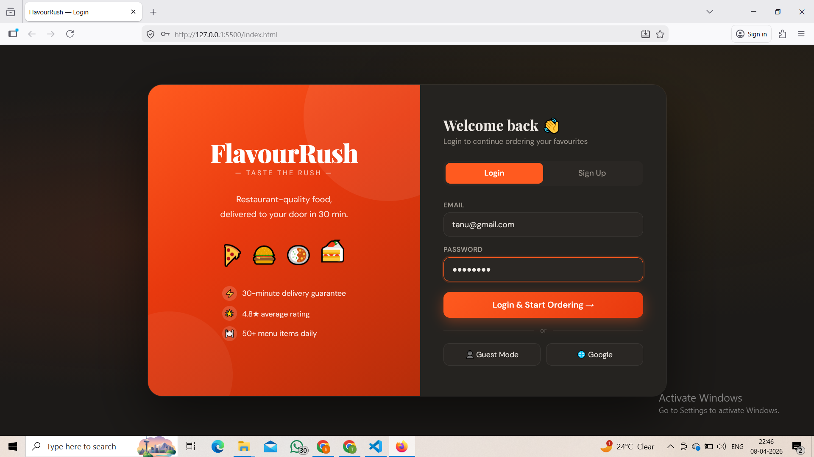
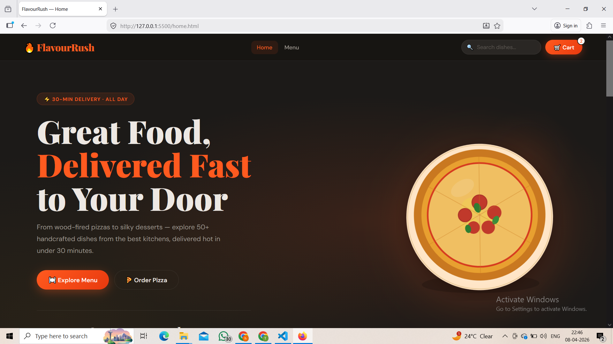
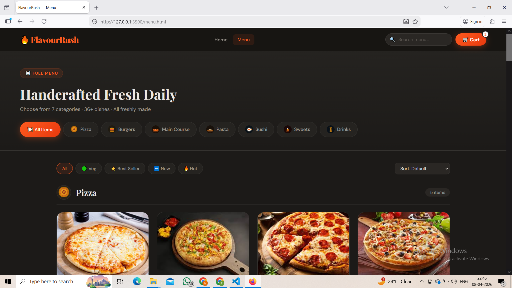
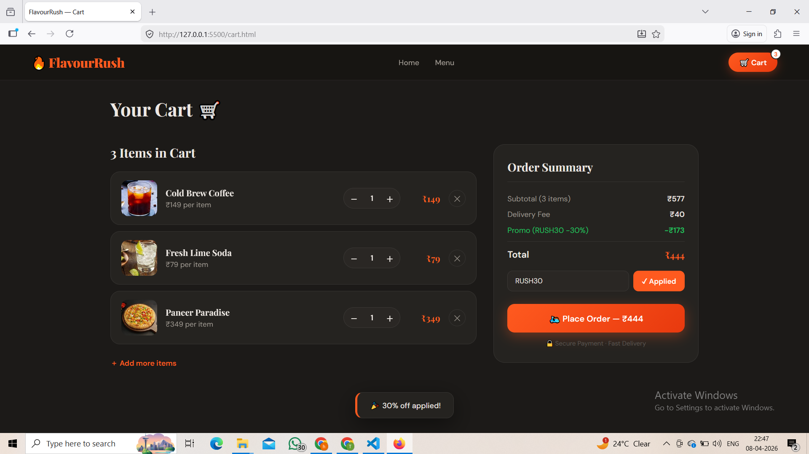

# 🍔 FlavourRush – Online Food Ordering Website

FlavourRush is a modern and user-friendly **food ordering web application** that allows users to explore a variety of food categories such as burgers, pizza, pasta, sushi, drinks, and desserts. The website provides an engaging interface where users can browse menu items, view food images, and add their favorite items to a shopping cart.

The main goal of this project is to demonstrate **frontend web development skills** including structured webpage design, user interface development, and interactive functionality using JavaScript.

This project simulates a simple **online food ordering platform** with multiple pages like a landing page, menu page, and cart page.

---

## 🌐 Live Demo

You can view the live version of the project here:

```
https://yourusername.github.io/FlavourRush/
```

*(Add your GitHub Pages link here after deployment.)*

---

## ✨ Features

* Modern and attractive user interface
* Multiple food categories such as burgers, pizza, pasta, sushi, drinks, and desserts
* Menu page displaying food items with images and details
* Add-to-cart functionality
* Navigation between multiple pages
* Organized layout for better user experience

---

## 🛠️ Technologies Used

This project is built using the following technologies:

* **HTML5** – Structure of the website
* **CSS3** – Styling and layout design
* **JavaScript** – Interactive functionality and cart behavior
* **Images & Media Assets** – Visual representation of food items

---

## 📂 Project Structure

```
FlavourRush/
│
├── index.html        # Landing page of the website
├── home.html         # Main home interface
├── menu.html         # Displays food menu and categories
├── cart.html         # Shopping cart page
│
├── style.css         # Styling and design of the website
├── app.js            # JavaScript functionality
│
└── images/           # Contains all food item images
```

The project follows a **simple and organized folder structure** which helps developers easily understand and maintain the code.

---

## 🚀 How to Run the Project

Follow these steps to run the project locally:

1. Clone the repository

```
git clone https://github.com/yourusername/FlavourRush.git
```

2. Navigate to the project folder.

3. Open the following file in your browser:

```
index.html
```

No additional dependencies or installations are required.

---

## 📸 Project Screenshots

You can add screenshots of your website here to showcase the UI.

Example:

```
screenshots/
   home-page.png
   menu-page.png
   cart-page.png
```

Then display them like this:

Login Page


Home Page


Menu Page


Cart Page


---

## 🎯 Project Objective

The objective of this project is to practice and demonstrate:

* Frontend web development
* User interface design
* JavaScript-based interaction
* Structuring a real-world web project

This project serves as a **basic prototype of an online food ordering platform**.

---

## 🔮 Future Improvements

Possible enhancements for future versions include:

* User login and authentication
* Backend integration for storing orders
* Database connectivity
* Online payment gateway integration
* Fully responsive mobile design
* Order history and user dashboard

---


⭐ If you like this project, consider giving it a star on GitHub.
